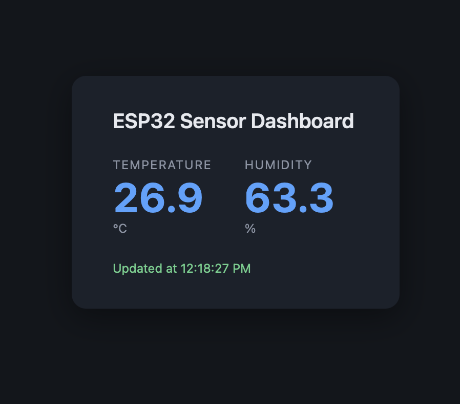

# esp32-http-server

A WiFi sensor dashboard for the ESP32, built with ESP-IDF v6.0. The board joins
an existing network in station mode, reads a DHT22 temperature and humidity
sensor in the background, and serves a live web dashboard from flash. The HTML,
CSS, JavaScript and icon are embedded into the firmware image, so no filesystem
partition is needed and the assets consume no RAM.

## Features

- WiFi station mode with a bounded reconnection policy
- HTTP server on port 80 with a wildcard URI handler
- Static assets embedded via CMake `EMBED_FILES` and served straight from flash
- DHT22 polled by a dedicated FreeRTOS task, never from a request handler
- `/api/sensor` JSON endpoint with a staleness indicator
- Browser polls the endpoint and survives reboots without a page refresh
- mDNS advertisement, so the board answers to `esp32.local`

## Hardware

This project uses a three-pin DHT22 breakout module. Pin labels vary between
manufacturers, so check the silkscreen on your own board.

| Module pin | Connection |
|------------|------------|
| `+` / `VCC` | 3V3 |
| `out` / `DATA` / `S` | GPIO 4, configurable |
| `-` / `GND` | GND |

Breakout modules carry the required pull-up resistor on the board, so no
external component is needed. A bare four-pin DHT22 does need a 10 kΩ resistor
between the data line and 3V3: the sensor only ever pulls the line low, so
without a pull-up the line floats and the driver reads noise. On the bare part
the third pin is unused.

GPIO 4 is used because it has no role during boot. Avoid GPIO 0, 2, 12 and 15:
those are strapping pins, and pulling them to the wrong level makes the board
select the wrong boot mode.

## Architecture

The interesting design decision is that the HTTP handler never touches the
sensor.

`esp_http_server` runs a single FreeRTOS task that multiplexes every connection
through `select()`. Reading a DHT22 is a bit-banged, timing-sensitive operation
that takes roughly 20 ms, and the sensor itself refuses to be sampled more
often than every 2 seconds. Reading it inside the handler would therefore stall
every other connection for the duration of the transfer, and a dashboard open
in two browser tabs would violate the sensor's minimum sampling interval.

Instead, a dedicated task samples the sensor on a fixed schedule and publishes
the result into a shared struct guarded by a mutex. The handler copies the last
known value and returns within microseconds. Sampling cost is therefore
independent of how many clients are connected.

The response carries an `age_ms` field so the browser can tell a fresh reading
from a stale one. When a sample fails, the endpoint keeps serving the previous
value with a growing age rather than returning an error, and the dashboard only
warns once the data is older than three sampling intervals.

## API

    GET /api/sensor

    200 OK, application/json
    {"temperature":26.4,"humidity":61.2,"age_ms":842}

    503 Service Unavailable, application/json
    {"error":"no reading yet"}

The 503 is returned until the first successful sample, roughly 3.5 seconds
after boot.

## Build and flash

    idf.py set-target esp32
    idf.py menuconfig      # WiFi credentials, DHT GPIO, mDNS hostname
    idf.py build
    idf.py -p <PORT> flash monitor

`sdkconfig` is deliberately not tracked in git because it holds the WiFi
password. All project settings live under "esp32-http-server Configuration" in
menuconfig.

Once running, open `http://esp32.local` or use the IP address printed in the
monitor output.

## Known limitations

- **HEAD requests are not supported.** `esp_http_server` matches handlers on
  the URI and method pair, and `httpd_resp_send()` always writes a body, so
  there is no clean way to answer a HEAD request with correct headers and no
  body. Registering the handler for `HTTP_HEAD` would either send a body, which
  violates the specification, or report `Content-Length: 0`, which is
  misleading. GET is used for everything.
- **mDNS resolution depends on the client.** macOS, iOS and Windows 10 1803 or
  newer resolve `.local` names out of the box. Linux needs `avahi-daemon`.
  Android browsers generally do not resolve `.local` at all. The IP address
  always works as a fallback.
- **Occasional sensor read timeouts are expected.** The WiFi task runs at
  priority 23 and can preempt the bit-banging driver mid-transfer, which
  corrupts the pulse-width measurement. Disabling interrupts during the read
  would fix it but would delay WiFi interrupt handling by about 20 ms and risk
  dropping packets. The current design absorbs the failure instead: a lost
  sample only increases `age_ms` until the next successful read.
- **Flash size is configured as 2 MB** even though the board carries 4 MB. The
  application partition has ample headroom, so this has not been changed.

## Project layout

    main/
      esp32-http-server.c   application entry point and startup order
      wifi_sta.c/.h         station mode setup and connection events
      http_server.c/.h      URI handlers and the static asset table
      sensor.c/.h           background sampling task and shared state
      dht.c/.h              bit-banged DHT22 driver
      mdns_service.c/.h     hostname and service advertisement
      www/                  dashboard assets embedded into the firmware